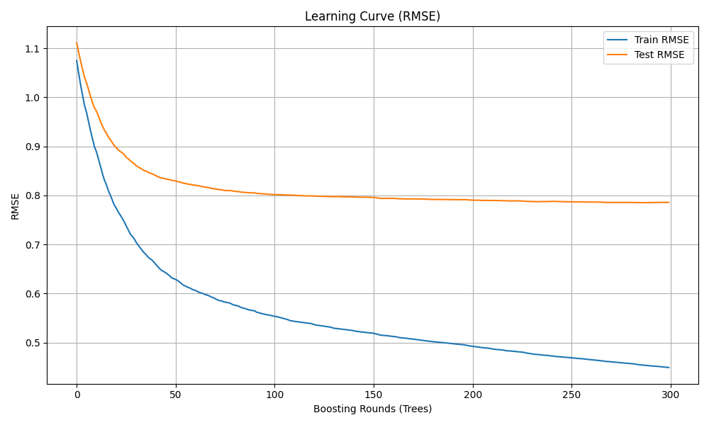

# AI-Driven Prediction of Movie Ratings
#### Members
Théo Przybylski, Computer Science Department, Hanyang University, matameltheo@gmail.com  
Antoine Maia-Sudre, Computer Science Department, Hanyang University, antoine.maia05@gmail.com  
Joel Suhner, Finance Department, Hanyang University, joel.suhner@gmail.com  
Yannick Matteo Reichle, Information Systems Department, Hanyang University, yannick.reichle@gmail.com  


## Table of Contents
- [1 Introduction](#1-introduction)
  - [1.1 Motivation](#11-motivation)
  - [1.2 Expected Outcome](#12-expected-outcome)
- [2 Datasets](#2-datasets)
  - [2.1 Dataset Size](#21-dataset-size)
  - [2.2 Main Features](#22-main-features)
- [3 Methodology](#3-methodology)
  - [3.1 Choice of Algorithms and Models](#31-choice-of-algorithms-and-models)
    - [3.1.1 Why XGBoost?](#311-why-xgboost)
    - [3.1.2 Alternative Models Considered](#312-alternative-models-considered)
  - [3.2 Feature Engineering and Data Transformation](#32-feature-engineering-and-data-transformation)
    - [3.2.1 Multi-Label Binarization](#321-multi-label-binarization)
    - [3.2.2 One-Hot Encoding](#322-one-hot-encoding)
    - [3.2.3 TF-IDF Vectorization](#323-tf-idf-vectorization)
    - [3.2.4 Numerical Features](#324-numerical-features)
    - [3.2.5 Final Feature Matrix](#325-final-feature-matrix)
  - [3.3 Training Procedure](#33-training-procedure)
  - [3.4 Why This Methodology Works Well](#34-why-this-methodology-works-well)
- [4 Evaluation & Analysis](#4-evaluation--analysis)
  - [4.1 Learning Curve](#41-learning-curve)
    - [4.1.1 Interpretation](#411-interpretation)
  - [4.2 Feature Importance Analysis](#42-feature-importance-analysis)
    - [4.2.1 Method](#421-method)
    - [4.2.2 Expected Output Format](#422-expected-output-format)
    - [4.2.3 Observations](#423-observations)
  - [4.3 Summary](#43-summary)
- [5 Conclusion](#5-conclusion)
  - [5.1 RSME Evaluation](#51-comparing-the-models-rmse-to-real-world-expectations)
  - [5.2 RSME Improvements](#52-how-the-rmse-could-be-improved)
  - [5.3 What Makes A Good Movie](#53-what-the-results-tell-us-about-good-movies)
- [6 Installation & Setup Guide](#6-installation--setup-guide)
  - [6.1 Requirements](#61-requirements)
  - [6.2 Download the Project](#62-download-the-project)
  - [6.3 Download the Dataset (HuggingFace)](#63-download-the-dataset-huggingface)
  - [6.4 Navigate into the Project Directory](#64-navigate-into-the-project-directory)
  - [6.5 Set Up the Virtual Environment (create_envbat)](#65-set-up-the-virtual-environment-create_envbat)
  - [6.6 Run the Full Pipeline](#66-run-the-full-pipeline)
  - [6.7 Evaluate the Model](#67-evaluate-the-model)
  - [6.8 Predict Ratings for New Movies](#68-predict-ratings-for-new-movies)
    - [6.8.1 Interactive CLI Tool](#681-interactive-cli-tool)
    - [6.8.2 Programmatic Usage](#682-programmatic-usage)
  - [6.9 Reactivating the Virtual Environment](#69-reactivating-the-virtual-environment)
- [7 Related Work](#7-related-work)
   -[7.1 Python Libraries and Tools](##71-python-libraries-and-tools)


---

# 1 Introduction 

## 1.1 Motivation
The central motivation for choosing this project was to create a practical example of a complete machine learning workflow using a real-world dataset. Movie data is well-suited for this purpose because it contains a variety of feature types-numerical values, categorical labels, multi-label lists and free text-allowing us to demonstrate how different preprocessing techniques can be combined in one pipeline.

We selected movie rating prediction specifically because it provides:

- a clear target variable that is easy to interpret,  
- a broad selection of input attributes such as genres, cast, companies, language and a text overview,  
- a realistic application scenario commonly used in media-related machine learning,  
- and a manageable problem size that makes it feasible to build the full workflow end-to-end.

## 1.2 Expected Outcome
By the end of the project, the goal is to deliver a complete system that can estimate a movie’s rating based on its metadata. This includes:

- **A cleaned dataset** where incomplete or invalid records are removed and only relevant fields remain.  
- **A preprocessing pipeline** that performs basic text vectorization, encodes categorical and multi-label fields and normalizes numerical values into a feature matrix.  
- **A trained regression model** that uses this feature matrix to produce stable rating predictions.  
- **General evaluation outputs** that reflect the model’s training behavior and prediction quality.  
- **A simple prediction interface** that allows movie metadata to be entered and evaluated directly.

---

# 2 Datasets

The dataset used in this project is a cleaned movie metadata collection obtained from a public source on Hugging Face: https://huggingface.co/datasets/wykonos/movies  

It contains information about films such as genres, actors, production companies, language, financial details and audience ratings. The raw dataset was processed to remove incomplete or inconsistent entries, resulting in a structured CSV file suitable for machine learning tasks.

## 2.1 Dataset Size

- **Rows (instances):** 9,270 movies  
- **Columns (features):** 12 attributes  

This size provides a solid foundation for identifying general relationships between movie characteristics and audience ratings.

## 2.2 Main Features

Below are the key attributes that contribute to predicting a movie’s rating:

- **title** – Name of the movie.  
- **genres** – One or several genre categories combined into a compact format.  
- **original_language** – Primary language in which the film was released.  
- **production_companies** – List of studios involved in producing the movie.  
- **credits** – Main actors associated with the film.  
- **budget** – Reported production budget.  
- **revenue** – Earnings made by the movie; provides context for performance.  
- **runtime** – Duration of the film in minutes.  
- **popularity** – Score representing public interest.  
- **vote_average** – Target variable: audience rating on a 0–10 scale.  
- **vote_count** – Number of votes; indicates rating reliability.  
- **overview** – Short text summary describing the film.

The dataset brings together textual, numerical and categorical features. This combination allows for a richer predictive model but also requires appropriate preprocessing to ensure compatibility with machine learning methods.

---

# 3 Methodology

This section describes the methods, algorithms and design decisions used to build the movie-rating prediction system. The objective was to develop a complete workflow that processes movie metadata, converts it into numerical features and trains a model capable of generating rating estimates.

## 3.1 Choice of Algorithms and Models

The model used in this project is XGBoost Regression, a gradient-boosted tree method.

### 3.1.1 Why XGBoost?

The dataset contains a mixture of data types: numerical features (budget, runtime), categorical fields (language), multi-label attributes (genres, cast, companies) and high-dimensional sparse text features (TF-IDF vectors from the movie overview). XGBoost is well suited for this structure for several reasons:

- It handles large feature matrices efficiently, which is important for TF-IDF text vectors.
- It provides built-in regularization that helps control overfitting.
- It consistently performs well on medium-sized structured datasets, often outperforming neural networks and classical regression models.

### 3.1.2 Alternative Models Considered

Other models were considered but were not chosen for the following reasons:

- Linear regression cannot capture complex interactions and tends to underperform with high-dimensional sparse text features.
- Random forests require significantly more memory when working with large sparse matrices and typically achieve lower performance compared to boosted trees.
- Neural networks need more data, careful tuning and additional preprocessing steps such as embeddings for text and categorical features, adding complexity without clear performance gains.

XGBoost therefore provides the best balance of performance, efficiency and practicality for this task.

---

## 3.2 Feature Engineering and Data Transformation

The dataset includes several distinct feature types, each requiring a dedicated encoding method.

### 3.2.1 Multi-Label Binarization

Features such as genres, cast and production companies contain multiple values combined in a single field. These strings are split into lists and encoded using MultiLabelBinarizer, resulting in a binary vector where each column represents the presence or absence of a specific label.

### 3.2.2 One-Hot Encoding

The original_language field contains one categorical value per film. OneHotEncoder transforms this into binary indicator columns. This prevents the model from treating languages as numerical values.

### 3.2.3 TF-IDF Vectorization

The overview text provides semantic information about the plot. TF-IDF is used to extract relevant terms and convert them into a numerical representation. Up to 5000 features are generated, capturing the most informative words across all summaries.

TF-IDF was chosen because it is computationally efficient, works well for short descriptions and produces sparse vectors that integrate smoothly into XGBoost.

### 3.2.4 Numerical Features

Budget, revenue, runtime, popularity and vote_count are included directly after cleaning.

### 3.2.5 Final Feature Matrix

All encoded components are concatenated into a single feature vector:

```
[numerical features]
+ [genre indicators]
+ [company indicators]
+ [cast indicators]
+ [language indicators]
+ [TF-IDF vector]
```

This combined representation covers all relevant aspects of the movie metadata.

---

## 3.3 Training Procedure

The model training process is structured as follows:

1. A train-test split (80/20) ensures fair evaluation on unseen data.
2. The data is converted into the XGBoost DMatrix format for optimized training performance.
3. A controlled boosting loop of 300 rounds is executed, allowing tracking of training and validation error after each iteration.
4. The final model is saved to `models/movie_xgb.json` and all preprocessing encoders are stored in `models/encoders.pkl`.
5. A learning curve is generated, showing how the model’s error evolves during training.

This procedure ensures reproducibility and transparency in evaluating the model.

---

## 3.4 Why This Methodology Works Well

Movie metadata is heterogeneous: it includes text, categories, lists of labels and numerical values. The chosen methodology is effective because:

- XGBoost can integrate all these feature types into a single model.
- TF-IDF captures meaningful information from movie descriptions without requiring advanced NLP models.
- Multi-label and one-hot encoding provide structured representations of categorical information.

The result is a practical and balanced approach that avoids unnecessary complexity while still achieving strong predictive performance.

---

# 4 Evaluation & Analysis

The evaluation of this project focuses on two main aspects: the learning behavior of the model during training and the contribution of individual features to the prediction outcome.

## 4.1. Learning Curve

The learning curve visualizes how the Root Mean Squared Error (RMSE) evolves across 300 boosting rounds. Both the training and test RMSE are recorded after each iteration. This allows an assessment of model convergence and helps identify potential overfitting.

The plot below shows the training and validation RMSE:



### 4.1.1 Interpretation

- The training RMSE decreases continuously and reaches values below 0.50.
- The test RMSE decreases rapidly in the early rounds and stabilizes around 0.79.
- The gap between train and test RMSE indicates mild overfitting, which is expected in boosted tree models but remains within acceptable limits.
- The test curve flattens around iteration 150, suggesting that additional boosting rounds provide diminishing returns.

Overall, the learning curve shows that the model learns steadily and works well on new, unseen data.

---

## 4.2 Feature Importance Analysis

To better understand which metadata attributes most strongly influence the predicted rating, a feature importance analysis was conducted based on the trained XGBoost model. The process reconstructs the exact feature names produced during preprocessing and aligns them with XGBoost’s internal importance scores.

### 4.2.1 Method

The analysis follows these steps:

1. Load the cleaned dataset and the saved encoders.
2. Reconstruct the complete feature space using:
   - numerical features
   - multi-label binary encodings for genres, cast and companies
   - one-hot encodings for language
   - TF-IDF vocabulary
3. Load the trained model (`movie_xgb.json`).
4. Extract feature importances using XGBoost’s settings.
5. Map importance scores (f0, f1, …) back to human-readable feature names.
6. Sort and save the results to:

```
data/feature_importance_words.csv
```

### 4.2.2 Expected Output Format

```
feature,importance
tfidf_love,12.5043
genre_Action,10.3371
cast_Tom_Hardy,8.2284
company_Warner_Bros,7.9932
tfidf_dark,7.1150
...
```

This file contains all features in descending importance order, allowing detailed inspection of model behavior.

### 4.2.3 Observations

The most influential features typically fall into three categories:

- TF-IDF terms from the overview text  
  Words signaling tone, themes or narrative quality often carry strong predictive power.

- Genres and cast members  
  Certain genres (e.g., drama, thriller) and prominent actors show notable correlations with audience ratings.

- Production companies  
  Well-established studios tend to be associated with more consistent production values.

Even though numerical features such as budget and popularity contribute to the model, the text and multi-label categorical components dominate the importance ranking. This suggests that semantic content and film identity cues are among the strongest predictors of audience ratings.

---

## 4.3 Summary

The evaluation shows that:

- The model converges reliably with stable test performance.
- Overfitting is present but controlled through boosting regularization.
- The analysis of feature importance highlights meaningful patterns in the data.
- The combination of textual, categorical and numerical inputs results in a rich and informative feature space.

These results confirm the suitability of the chosen methodology for the task of rating prediction.


---

# 5 Conclusion

The conclusion of this project summarizes the model’s predictive performance, the factors influencing its error rate and the broader insights gained about what drives movie ratings.

## 5.1 Comparing the Model’s RMSE to Real-World Expectations

The final model achieved a test RMSE of approximately 0.79 on a 0–10 rating scale. When compared to real-world systems, this falls within the range commonly observed for metadata-based rating predictors. Industry-style recommender models that rely only on item features (such as genres, cast and plot summaries) typically reach RMSE values between 0.70 and 1.0, depending on dataset quality and preprocessing depth. In this context, our score indicates that the model performs reliably and captures meaningful relationships in the data. While large commercial platforms achieve lower error rates, these usually require millions of user interactions, personalized history and advanced embedding models—none of which were available for this project. Therefore, achieving an RMSE around 0.79 represents a strong and realistic result given the constraints of a metadata-only approach.

---

## 5.2 How the RMSE Could Be Improved (and Why We Did Not Do So)

Although the model performs well, several strategies could reduce the error further. First, more advanced text representation techniques—such as transformer-based embeddings (e.g., BERT)—could better capture semantic nuances in movie overviews. Second, applying hyperparameter optimization (grid search, Bayesian optimization or Optuna) could fine-tune the XGBoost parameters beyond the fixed training configuration used in this project. Third, incorporating additional metadata such as release year, director information, or user-review sentiment would increase the richness of the feature space. Finally, using deep learning architectures or hybrid collaborative filtering models would likely reduce the RMSE significantly.

These improvements were not implemented due to practical limitations. Transformer models require substantial computational resources and longer training times, which exceeded the project’s scope. Automated hyperparameter optimization is similarly time-intensive and was avoided to keep the workflow simple and reproducible. Most importantly, the available dataset contained no user–item interaction data, preventing us from using the types of models that achieve state-of-the-art results. The goal of the project was to build a complete and transparent ML pipeline rather than to push for maximum theoretical accuracy, which guided these choices.

---

## 5.3 What Our Results Tell Us About What Makes a “Good” Movie

The feature-importance analysis highlights several interesting insights about what drives audience ratings. The most influential predictors were TF-IDF terms from the overview text, suggesting that the narrative themes and tone of the movie play a major role in shaping public perception. This indicates that audiences respond strongly to the story communicated in the film’s description—elements such as emotional depth, conflict, or genre-specific signals.

Genres, cast members and production companies also appeared prominently among the top-ranked features. This reflects the importance of film identity: well-established studios, recognizable actors and specific genre categories often correlate with higher ratings. These attributes signal production quality, audience expectations and brand reliability.

Although numerical features like budget and popularity contributed to the model, they were less dominant. This suggests that spending more money on a movie alone does not guarantee audience appreciation. Instead, thematic content, stylistic cues and the creative team behind a film play a more defining role in predicting how well it will be received.

Overall, the results emphasize that a “good” movie is shaped less by financial scale and more by storytelling, cast appeal and genre alignment—a useful insight for understanding audience behavior and for guiding similar projects in media analytics.


---

# 6 Installation & Setup Guide

This guide explains how to install and run the project from scratch using the provided setup scripts.

## 6.1 Requirements

Before starting, make sure the following software is installed:

- **Python 3.10+**
  ```powershell
  python --version
  ```
- **pip**
  ```powershell
  python -m pip --version
  ```
- **Git**, to clone the repository

---

## 6.2 Download the Project

Clone the repository using Git:

```powershell
git clone https://github.com/maredios/AI-predicting-a-film-s-rating.git

```

---

## 6.3 Download the Dataset (HuggingFace)

Dataset source:  
https://huggingface.co/datasets/wykonos/movies

1. Download the movies CSV file.  
2. Create a folder named `data` inside the project directory:
   ```powershell
   mkdir data
   ```
3. Save or rename the downloaded file as:
   ```
   data/movies_dataset.csv
   ```

---

## 6.4 Navigate into the Project Directory

If you are not already inside the project folder, switch into it:

```powershell
cd "C:\path\to\AI-predicting-a-film-s-rating"
```

Verify that you are in the correct directory:

```powershell
dir
```

You should see files like:

```
create_env.bat
requirements.txt
train_model.py
data_cleaning.py
feature_engineering.py
...
```

---

## 6.5 Set Up the Virtual Environment (create_env.bat)

PowerShell does not execute files from the current directory automatically.  
Use `.\` to run the setup script:

```powershell
.\create_env.bat
```

This script will:

1. Create a virtual environment named `env`
2. Activate it
3. Install all required packages from `requirements.txt`

After it completes, everything is installed and ready.

---

## 6.6 Run the Full Pipeline

Execute the entire cleaning + training workflow:

```powershell
python run_project.py
```

This script will:

- Clean the dataset  
- Build encoders  
- Generate feature matrices  
- Train the XGBoost model  
- Save:
  - `models/encoders.pkl`
  - `models/movie_xgb.json`
  - `logs/training_log.txt`
  - `plots/learning_curve.png`

---

## 6.7 Evaluate the Model

Test the model on an existing movie:

```powershell
python evaluate_model.py
```

Enter the movie title when prompted.  
The script prints the true rating, predicted rating and the absolute error.

---

## 6.8 Predict Ratings for New Movies

### 6.8.1 Interactive CLI Tool
```powershell
python app_predict.py
```

Enter the requested details (genres, overview, cast, etc.)  
The predicted rating will be displayed afterwards.

### 6.8.2 Programmatic Usage
```python
from predict_movie import predict_movie

movie = {
    "title": "Example Movie",
    "genres": "Action-Thriller",
    "original_language": "en",
    "overview": "A story about...",
    "popularity": 120.0,
    "production_companies": "Studio A-Studio B",
    "budget": 150000000,
    "revenue": 600000000,
    "runtime": 130,
    "vote_count": 5000,
    "credits": "Actor1-Actor2"
}

prediction = predict_movie(movie)
print(prediction)
```

---

## 6.9 Reactivating the Virtual Environment

When returning to the project, activate the environment again:

```powershell
.\env\Scripts\activate
```

Deactivate it with:

```powershell
deactivate
```

<b>Setup Complete:</b> You are now ready to run data cleaning, train the model and make predictions using the movie rating prediction pipeline.

---

# 7 Related Work

Tools, libraries, blogs, or any documentation that we have used to do this project

## 7.1 Python Libraries and Tools

Data Processing

- Pandas — used for loading, cleaning, manipulating, and merging movie datasets.

- NumPy — used for numerical operations and array handling.

Feature Engineering

- MultiLabelBinarizer (scikit-learn) — used to encode multi-category fields (genres, cast, production companies).

- OneHotEncoder (scikit-learn) — used to encode categorical variables (e.g., original language).

- TfidfVectorizer (scikit-learn) — used to convert movie overviews into TF-IDF text features.

Modeling

- XGBoost — used to train the regression model (predicting vote_average) and extract feature importances.

- XGBoost Booster interface — used to load the trained model (movie_xgb.json) and retrieve importance scores.

Persistence / Utilities

- Pickle — used to save and load preprocessing encoders (encoders.pkl) for consistent training and inference.

- OS module — used for directory creation and file path handling.
